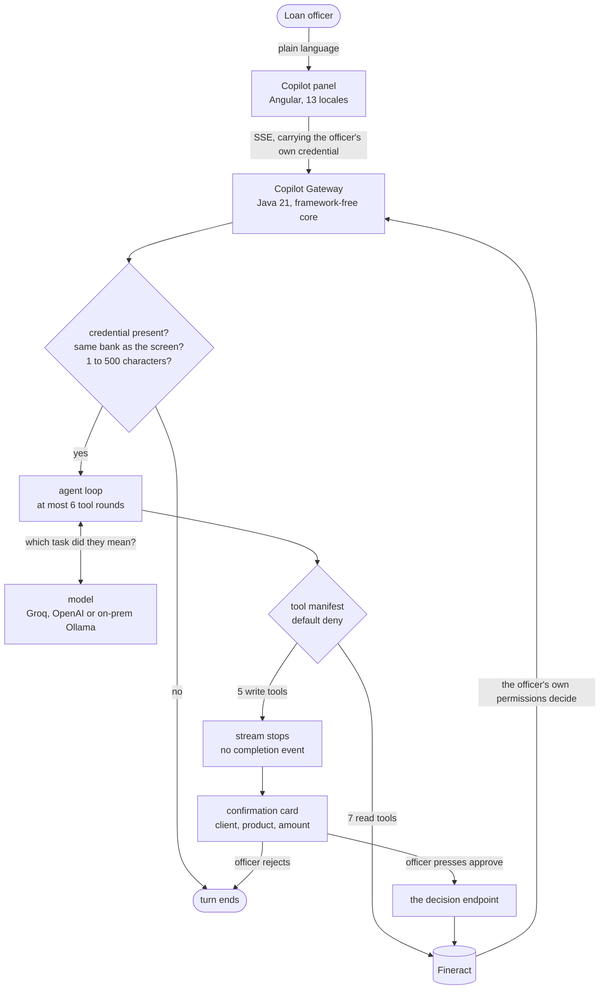

# GSoC 2026 Final Report: Shubham Kumar

**project:** Mifos X Copilot, an AI assistant for loan officers with a human approval step before anything moves money

**organization:** [The Mifos Initiative](https://mifos.org/)

**mentor:** Victor Romero

**repositories:** [openMF/web-app](https://github.com/openMF/web-app) for the panel, [openMF/mcp-mifosx](https://github.com/openMF/mcp-mifosx) for the gateway

**demo with screenshots:** https://shubhamkumar9199.github.io/mifos-copilot-showcase/

## Overview

Mifos X is the web application that loan officers at microfinance institutions use every day. Almost every task means walking through several screens of forms, and new staff need weeks of training before they are useful on it.

This project adds an assistant to the application so an officer can say what they need in plain language. Find a client. Show me a repayment schedule. Submit a loan application, approve it, record a repayment.

The whole design rests on one rule. The assistant can propose a change to a financial record and it can never make one. When it wants to write, the reply stops, the officer is shown a card naming the client, the product and the amount in words they recognise, and nothing runs until a person presses approve.

What was delivered:

- A Copilot panel inside the web app, translated into all 13 locales, off by default and switched on per deployment
- A Copilot Gateway, a new Java 21 service whose reasoning core carries no framework imports, so it can later be embedded inside Fineract rather than deployed beside it
- The write pause, which suspends the response stream and resumes only on an explicit human decision, on a separate endpoint
- Credential passthrough, so the gateway holds no Fineract account of its own and acts as the officer
- A default-deny tool manifest of 12 tools, 7 that read and 5 that write, with anything else the model names refused
- Thinking output, showing what the assistant did and what the model wrote while doing it, kept apart because only one of them is a record

## Architecture

Four HTTP endpoints, all under `/copilot/api/v1`. `chat` and `actions/{cardId}/decision` stream server-sent events, `health` and `meta` are diagnostics.

The officer's `Authorization` header is read from the inbound request and forwarded, never rewritten and never stored. There is no Fineract credential anywhere in the gateway's source.

## Work Completed

### 1. The panel

[#3648](https://github.com/openMF/web-app/pull/3648), [#3671](https://github.com/openMF/web-app/pull/3671), [#3675](https://github.com/openMF/web-app/pull/3675), [#3677](https://github.com/openMF/web-app/pull/3677), [#3678](https://github.com/openMF/web-app/pull/3678), [#3696](https://github.com/openMF/web-app/pull/3696)

June was the frontend. A standalone Angular panel that loads only where it is switched on, so a deployment that does not want it pays nothing for it.

Three decisions from this period held for the rest of the project. Translations went in with the strings rather than being left as English placeholders to fill in later, so all 13 locales were populated from the first PR. Context detection reads the router to know which client or loan is on screen, so nobody types a database id into a chat box. And an input sanitiser sat between the officer and the model before there was a model to send anything to.

### 2. The gateway

[#421](https://github.com/openMF/mcp-mifosx/pull/421)

The service that turns a sentence into banking operations. Java 21 and Spring Boot WebFlux, but the reasoning core imports no framework at all, and a test enforces that rather than a convention: `FrameworkFreeCoreTest` fails the build if anything in `core` reaches for Spring. The Spring shell is five classes.

That constraint exists so the same core can later be embedded inside Fineract as a plugin instead of running as a separate service, without rewriting the part that does the thinking.

The write pause lives here rather than being bolted on afterwards. When the model asks for a write, the loop stops before executing anything, resolves the values that would actually be sent, reads back the client and product names so the card can use them, and emits the card without a completion event. The turn is suspended. Execution happens only through `POST /actions/{cardId}/decision`, and a card is taken rather than read, so it cannot be spent twice.

### 3. Connecting the two

[#3819](https://github.com/openMF/web-app/pull/3819)

Server-sent events, so the answer appears as it is written rather than after it is finished. Native `EventSource` cannot POST a body or set the tenant and authorization headers this contract needs, so the transport is `fetch` plus a `ReadableStream` reader.

### 4. Making the cards read like banking

[#434](https://github.com/openMF/mcp-mifosx/pull/434), [#437](https://github.com/openMF/mcp-mifosx/pull/437), [#3889](https://github.com/openMF/web-app/pull/3889)

The first working version showed the officer the model's raw function-call arguments. `clientId: 1`, `principal: 5000`, `expectedDisbursementDate: "2026-08-22"`. That is a debug view, and a confirmation step nobody can read is not a confirmation step.

Cards are now built by the server from the parsed call and never from model prose, with labelled rows, money formatted as money, dates as dates, and the client and product named by reading them back from Fineract first. The receipt after a write names the account instead of reporting `Loan ID 1`.

### 5. Reading values from where they live

[#438](https://github.com/openMF/mcp-mifosx/pull/438)

Seven defects of a single shape: a value that should come from the product, the officer's credential or Fineract's own calendar was written as a literal instead. The worst of them meant every client was created in office 1 regardless of who created them. The office is now derived from the officer's own credential, and fails closed if it cannot be established.

### 6. Holding the assistant to the same rules as the form

[#439](https://github.com/openMF/mcp-mifosx/pull/439)

A reviewer created a client whose first name was `999999999999999`, and Fineract accepted it. The web app's own forms would have refused it, because that validation lives in the form rather than in the API.

Rather than invent a second set of rules, the manifest now carries the constraints the web app's validators already enforce, parameter by parameter, and a value that fails them never reaches the bank. A broken pattern in the manifest is swallowed rather than thrown, so a typo cannot take a tool out of service.

### 7. Deployment reality

[#440](https://github.com/openMF/mcp-mifosx/pull/440), [#447](https://github.com/openMF/mcp-mifosx/pull/447), [#3905](https://github.com/openMF/web-app/pull/3905)

"Remember that in production the API URL can be different from the UI URL because of an API gateway." The Fineract API root was hardcoded in 18 manifest entries and 3 request builders. It is now one configuration value, and the manifest holds only resource-relative paths.

Getting it wrong looks like the gateway being broken rather than misconfigured. `/health` stays green because it never touches Fineract, while every tool call returns 404 and the assistant reports that a client who plainly exists cannot be found. That is written down now, with a worked example.

### 8. What an officer can do with a reply

[#3903](https://github.com/openMF/web-app/pull/3903)

A reply was something to read and nothing else. It now carries copy, ask again, rate, export to PDF and share, plus a full-screen mode and a Preferences tab that had previously rendered a heading and nothing under it.

The PDF is rendered through the browser rather than written as PDF text, because the built-in fonts cover Latin-1 and this panel is translated into Korean and Nepali among others. A filed banking document showing boxes where the answer was would be worse than no export at all.

Preferences also carries the setting that matters most. Conversations are held in the browser, and on a shared branch machine a transcript naming clients and balances outlives whoever produced it. Turning history off erases what is already there rather than only stopping new writes.

### 9. Finding a client the way people type names

[#443](https://github.com/openMF/mcp-mifosx/pull/443), [#446](https://github.com/openMF/mcp-mifosx/pull/446)

Searching used `/search`, which matches case-sensitively. Against a client stored as `Aisha Bello`, both `aisha` and `AISHA` returned nothing, so an officer typing normally was told the person did not exist and the assistant then apologised for a client sitting in the database.

The first fix was wrong in a way worth recording. It moved to `/clients?name=`, a parameter Fineract does not bind, so the filter was silently dropped and the endpoint returned every client in the office. I had verified it against a database holding one client, where "filtered to the one match" and "ignored the filter and returned all one of them" are the same number.

The second corrected it to `displayName`, which is the filter that exists, and handles the casing on our side. A name typed in one case is capitalised, and a name carrying capitals of its own is left exactly as written, because `McDonald` rewritten as `Mcdonald` finds nobody.

### 10. Thinking output

[#449](https://github.com/openMF/mcp-mifosx/pull/449), [#3913](https://github.com/openMF/web-app/pull/3913), [#3916](https://github.com/openMF/web-app/pull/3916)

Asked for explicitly, citing responsible AI and explainable AI. The gateway had been reading only the content field, so on a reasoning model every word of the thinking was discarded before it left the server.

It now reads `reasoning`, `reasoning_content` and `thinking` across providers, and handles models that leave `<think>` markers inline in the content. That last case is harder than it looks. Deltas are fragments, so `"<th"` followed by `"ink>"` is ordinary, and anything released early is on the officer's screen for good. Any tail that could still grow into a marker is held until the next chunk decides it. The tests feed the text one character at a time, because if it survives that it survives any chunking a provider can produce.

The panel shows one collapsed strip under each reply, carrying two things that are not the same kind of thing. That distinction is discussed under Challenges below.

## Testing and CI

The gateway has 157 tests, pure JUnit against the framework-free core. Two of them are structural rather than functional. `FrameworkFreeCoreTest` fails the build if the core acquires a framework import, and `RedactionPostureTest` pins what every tool masks, so adding a tool or dropping a mask fails the suite instead of passing quietly.

The panel has 168 tests under Jest, and a Playwright suite runs in the web app's existing CI, which stands up a real Fineract in Docker. That suite turns the Copilot on itself by rewriting the deployment config as it is served, so it genuinely runs rather than skipping on a flag.

Every change was also driven against the community sandbox with a real model before it went up. Several of the defects described below were found that way rather than by a test.

## Current State

Everything raised has been merged. 23 pull requests, nothing outstanding.

The Copilot works end to end: reading client, loan and savings data, creating clients, and running the loan lifecycle behind the confirmation step. It ships off by default and a deployment turns it on with two environment values. It has been run against Groq, OpenAI, and an on-premise Ollama instance holding `qwen3.8`.

### Gateway, openMF/mcp-mifosx

| # | title |
| --- | --- |
| [#421](https://github.com/openMF/mcp-mifosx/pull/421) | the Copilot Gateway, with the write pause built in |
| [#433](https://github.com/openMF/mcp-mifosx/pull/433) | date commands from Fineract's calendar, and make the openai provider work |
| [#434](https://github.com/openMF/mcp-mifosx/pull/434) | make confirmation cards read like banking, not like a database |
| [#437](https://github.com/openMF/mcp-mifosx/pull/437) | the receipt after a write names the account, not its id |
| [#438](https://github.com/openMF/mcp-mifosx/pull/438) | read values from the product and the credential, not from literals |
| [#439](https://github.com/openMF/mcp-mifosx/pull/439) | hold the Copilot to the same rules as the form |
| [#440](https://github.com/openMF/mcp-mifosx/pull/440) | let a deployment say where its Fineract actually lives |
| [#443](https://github.com/openMF/mcp-mifosx/pull/443) | find a client whoever typed the name, and say when the officer is throttled |
| [#446](https://github.com/openMF/mcp-mifosx/pull/446) | client search returns every client in the office |
| [#447](https://github.com/openMF/mcp-mifosx/pull/447) | document FINERACT_API_PATH and the rest of the configuration |
| [#449](https://github.com/openMF/mcp-mifosx/pull/449) | surface the model's reasoning and the steps it took |

### Panel, openMF/web-app

| # | title |
| --- | --- |
| [#3648](https://github.com/openMF/web-app/pull/3648) | Copilot UI foundation: panel, components, theming, feature flag, lazy loading |
| [#3671](https://github.com/openMF/web-app/pull/3671) | i18n across all 13 locales |
| [#3675](https://github.com/openMF/web-app/pull/3675) | AIContextService for context detection |
| [#3677](https://github.com/openMF/web-app/pull/3677) | deploy-configurable via runtime env files |
| [#3678](https://github.com/openMF/web-app/pull/3678) | InputSanitizer security gate |
| [#3696](https://github.com/openMF/web-app/pull/3696) | core services and the confirmation dialog |
| [#3819](https://github.com/openMF/web-app/pull/3819) | wire the panel to the gateway over SSE |
| [#3889](https://github.com/openMF/web-app/pull/3889) | name the account on confirmation cards, and settle on one product name |
| [#3903](https://github.com/openMF/web-app/pull/3903) | copy, repeat, rate, export and share a reply; full screen; a real Preferences tab |
| [#3905](https://github.com/openMF/web-app/pull/3905) | link the Copilot documentation from the README |
| [#3913](https://github.com/openMF/web-app/pull/3913) | thinking output for the Copilot |
| [#3916](https://github.com/openMF/web-app/pull/3916) | review findings on the thinking panel |

## Challenges and Design Decisions

### The write pause had to be structural, not a prompt

The obvious way to build a safe assistant is to tell the model to ask before writing. That is a request, not a guarantee, and it fails exactly when it matters.

Instead the pause lives in the loop. A write tool is intercepted before execution, the arguments are normalised so the card and the eventual request cannot disagree, and the stream ends without a completion event. There is no path from a model's output to a Fineract write that does not go through a human pressing approve, because the only code that executes a write sits on the decision endpoint.

### What explainable honestly means here

Showing the model's reasoning was requested citing responsible AI. The tempting reading is that a chain of thought explains the answer. It does not. Measured faithfulness sits at roughly 25 to 39%, the BIS Financial Stability Institute has put on record that reasoning models' explanations "do not necessarily reflect how the models actually arrive at their conclusions", and NIST IR 8312 requires an explanation to reflect the system's actual process.

So the panel shows two things and keeps them apart. The steps are a record: each is a call the gateway made, named by the tool manifest rather than by a model, so it says what happened and says the same thing every run. The model's own text sits below them, labelled as working text, with a line stating plainly that it is not a record of how the answer was produced and not a credit assessment.

Two placement decisions follow from the same evidence. It sits below the answer rather than above, because detailed explanations are known to increase reliance on a recommendation including when that recommendation is wrong, and a preamble frames an answer before it is read. And it is closed by default even on write turns, because expanding a plausible but unfaithful narrative at the moment an officer is deciding is the worst possible placement.

Four locales had translated the heading as *Reasoning*. That is the word this panel deliberately avoids, and it took a review comment to notice the English decision had not survived translation.

### Verifying against one row proves nothing

The client-search regression is the mistake I learned most from. I moved the search to a query parameter Fineract does not bind, checked it against a sandbox holding a single client, and reported it as verified. With one row, correct filtering and no filtering produce identical output. It reached `main` before a later test seeded four clients and the failure became obvious.

A reviewer had flagged the parameter and I dismissed it using that same one-row evidence. The regression test now pins the parameter name specifically, because a wrong one fails silently and open, which is the shape of failure a manual check cannot see.

### A model's private text must never render as advice

The riskiest thing this feature can do is put a model's deliberation in front of an officer as though it were guidance. Two separate defects pointed at that.

The first was a fenced block of suggested prompts that was only removed once a turn finished, so for the length of the stream the officer read it as prose. The second was subtler. Once a native reasoning field had been seen, content skipped the marker splitter entirely, on the assumption that a provider separating the two would not also inline them. That is an assumption about every proxy in front of every engine. Content now always goes through the splitter, because nothing legitimate is lost and fail-closed is the right default on that path.

### Where the officer's permissions live

The gateway could have held a service account. It would have been simpler and it would have been wrong. Every action would have appeared in the audit trail as the assistant rather than as the person, and the assistant would have been able to do things the officer cannot.

Forwarding the officer's own credential means Fineract's role-based access control remains the authority, unchanged, and the audit trail names a person. The cost is that the gateway can do nothing on its own, including when that would be convenient, which is the correct trade.

### Nothing here was found by reading the code

Almost every pull request after the gateway landed exists because someone used the thing for real and it fell short. Writes failed every evening because commands were dated from the server's clock rather than Fineract's business date. A client was created with a fifteen-digit first name. A lowercase search reported that a client did not exist. Two quick questions produced "the model is unavailable" when the officer was rate limited for seven seconds.

The lesson I would take into any project: a demo proves a feature exists, and only sustained use by somebody who did not build it proves the feature works.

## About AI Tools

I used Claude as a coding assistant throughout this project, for brainstorming designs, debugging, writing code and tests, and drafting pull request descriptions. I want to be upfront about that rather than leave it to be inferred.

What I can say alongside it is that every change was tested end to end against the community sandbox before it went up, every pull request went through my mentor's review, and the decisions about what to build and why were mine. Several of the corrections in this report are cases where I had to overrule an assistant's first answer after checking it against a real Fineract.

Working this way also changed how I learn. I had to pick up Spring WebFlux, server-sent events and Playwright in weeks rather than months, and having something to question made that much faster. I could ask why one approach beats another, argue with the answer, and test it immediately. It did not think for me, but it made me consider more directions than I would have alone, and it taught me to verify everything rather than trust the first plausible answer. That habit is the part I will keep.

## Acknowledgements

To Victor Romero, for reviewing like a banker rather than like a linter. He never handed me the fix. He would say something like "remember that in production the API URL can be different from the UI URL because of an API gateway" and leave me to work out what that meant for the design. Learning to read a review comment as a question about users, rather than a complaint about my code, is the most useful thing I take from this summer.

To the Mifos community for the sandbox, the answers and the patience, and to Google Summer of Code for the opportunity.

## Future Work

State that survives a restart is the first thing a production deployment will need. Pending confirmation cards and conversations live in process memory, which is correct for one instance and wrong for a cluster.

Group and centre lending is the obvious next surface. The manifest covers individual lending only, which leaves out a great deal of how microfinance actually works, and the manifest is designed so adding a capability is a reviewable act rather than a prompt change.

On-premise inference already works and has been tested against a live Ollama instance, but it is not yet documented for institutions that cannot send data to a cloud provider. That audience is exactly the one this matters most for.

A permalink for a reply is deliberately absent today. Conversations are held in the browser so client details never accumulate on the gateway, and a shareable link would need the opposite, so it is worth revisiting only once the data-residency question has an answer.

## Resources

- [openMF/web-app](https://github.com/openMF/web-app), the Mifos X web application
- [openMF/mcp-mifosx](https://github.com/openMF/mcp-mifosx), the Copilot Gateway
- [Apache Fineract](https://github.com/apache/fineract), the core banking backend
- [Copilot Gateway documentation](https://github.com/openMF/mcp-mifosx/blob/main/gateway/README.md), covering the tools, the confirmation flow, and how to run and deploy it
- [Demo and screenshots](https://shubhamkumar9199.github.io/mifos-copilot-showcase/)
